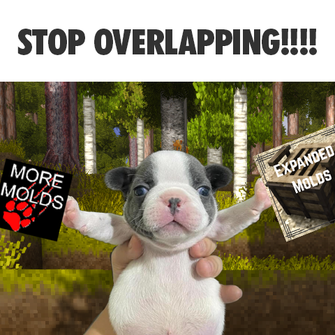

# Expanded-Molds-and-YABBA-Forge-overlap-remover
 
Removes the ingot, plate, chutes, hoop, and nail &amp; strip molds from YABBA Forge when Expanded Molds is present. Only the ingot and hoop molds when EM Lite is installed.
