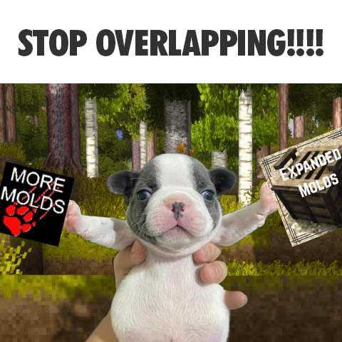

# Expanded-Molds-and-YABBA-Forge-overlap-remover

 

Removes the ingot, plate, chutes, hoop, and nail &amp; strip molds from YABBA Forge when Expanded Molds is present. Only the ingot and hoop molds when EM Lite is installed.

If Molds by MrFlame is installed, then its Ingot and Chute molds are removed in favor of Expanded Molds (or the lite version). And the following changes are also made:

* Removed from YABBA: Arrowhead, Spearhead, Chisel, Knife, Wrench
* Removed from Expanded Molds: Nail and Strips, Chain rings

This trifecta gives you YABBA's ingot pucks, sheets and handsaw, with the colored molds of Mr. Flame's molds and chain mail crafting, and the detailed bulk molds from Expanded Molds.

## Requires

<https://mods.vintagestory.at/moremolds> (**Now Optional**)

AND

<https://mods.vintagestory.at/expandedmolds>

**OR**

<https://mods.vintagestory.at/expandedmoldslite>

AND (OPTIONAL)

<https://mods.vintagestory.at/molds>

Credit to Anego Studios for the legacy textures provided.
